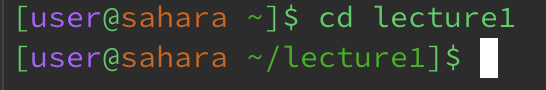
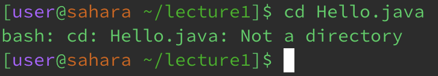
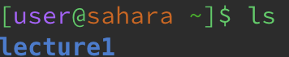
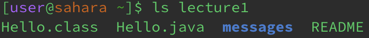
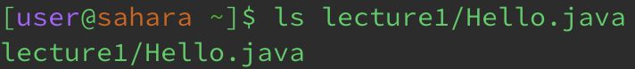
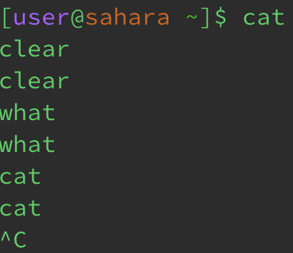
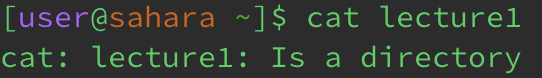
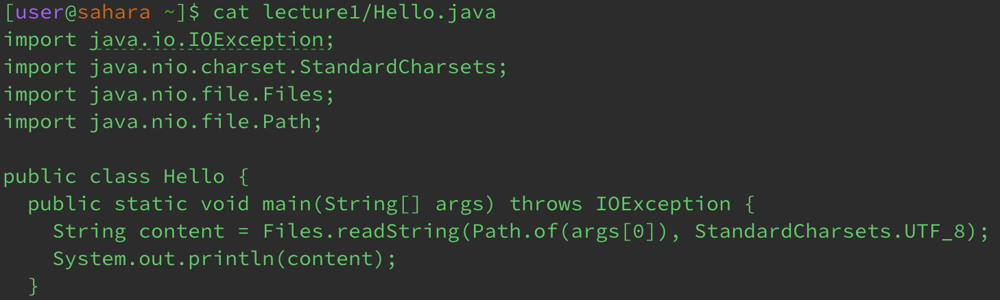

# Lab Report 1

## cd command
* __No arguments__
  
  
  
  Directory: `/home`

  Running `cd` without any arguments results in the terminal path being reset to the home directory. This behavior is intentional and is meant to be used to reset the terminal working location.

  This is not an error.
* __Directory argument__

  
  
  Directory: `/home`

  Running `cd` with a directory argument does excactly what it is defined to do and directs the terminal in the direction of directory argument provided. Any commands given will now take place in the directory provided unless `cd` is called again pointing the terminal to another direction.

  This is not an error.
* __File Argument__

  

  Directory: `/home/lecture1`

  Running `cd` with a file argument is not a valid command and will result in no change.

  This is an error as the `cd` command expects a directory as an argument.
  
## ls command
* __No arguments__

  
  
  Directory: `/home`

  Running `ls` with no arguments will list the contents of the current directory.

  This is not an error.
* __Directory argument__

  
  
  Directory: `/home`

  Running `ls` with a directory as an arugment will list the contents inside of that directory. The directory path will remain the same and does not change like the `cd` command.

  This is not an error.
* __File Argument__

  
  
  Directory: `/home`

  Running the `ls` command on a file argument does not operate like the other ls commands and instead lists the information of the file. In this case, running the `ls` command returns the file path of the file passed as an argument.

  This is not an error.

## cat command
* __No arguments__

  

  Directory: `/home`

  Running the `cat` command with no arguments seems like mistake at first as it simply repeats the following thing that the user inputs back at them. However, this behavior is completely intentional is simply reads the input of the user rather than the file.

  This is not an error.
* __Directory argument__

  

  Directory: `/home`

  Running the `cat` command on a directory argument is not the proper usage of the command as it is meant to be used on files and display their contents. The `cat` command is not able to display the contents of a directory.

  This is an error as the `cat` command has no way of diaplaying the contents of directories.
* __File Argument__

  

  Directory: `/home`

  Running the `cat` command on a file argument is the proper usage of the command and it is meant to display the conntents of the file or files which were passed along as arguments.

  This is not an error.
