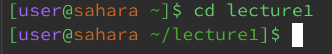
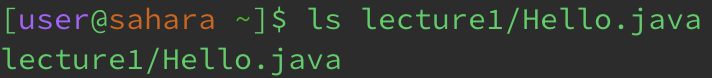
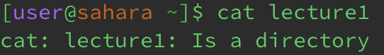

# Lab Report 1

## cd command
* __No arguments__
  
  
  Directory: root
* __Directory argument__

  
* __File Argument__

  

## ls command
* __No arguments__

  
* __Directory argument__

  
* __File Argument__

  

## cat command
* __No arguments__

  
* __Directory argument__

  
* __File Argument__

  
