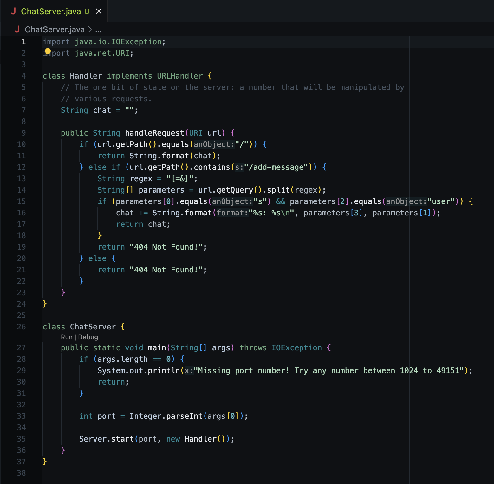
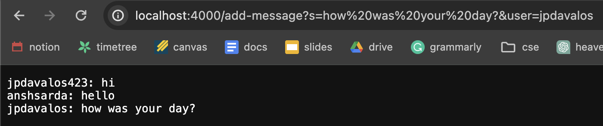
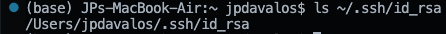
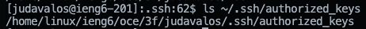

# Lab Report 2

## Part 1

### Code for `ChatServer`

### Using `ChatServer`

* The method called is `handleRequest`
* Arguments used are parameters[1] and parameters[3] which correspond to `user` and `s`
  * `user` contains "jpdavalos"
  * `s` contains "how was your day?"
* The value of `parameters` is updated after splitting the string using `regex`
  *  `parameters[0]` remains the same as `s`
  *  `parameters[1]` changes to "jpdavalos"
  *  `parameters[2]` remains the same as `user`
  *  `parameters[3]` changes to "how was your day?"
* The value of `chat` is concatnated with the new set of strings and stored into `chat`
* The value of `regex` remains the same as it is meant to facilitate the splitting of strings
* The value of `url` is changed to "http://localhost:4000/add-message?s=test&user=jpdavalos423"

 

* The method called is `handleRequest`
* Arguments used are `parameters[1]` and `parameters[3]` which correspond to `user` and `s`
  * `user` contains "anshsarda"
  * `s` contains "pretty good how about you?"
* The value of `parameters` is updated after splitting the string using `regex`
  *  `parameters[0]` remains the same as `s`
  *  `parameters[1]` changes to "anshsarda"
  *  `parameters[2]` remains the same as `user`
  *  `parameters[3]` changes to "pretty good how about you?"
* The value of `chat` is concatnated with the new set of strings and stored into `chat`
* The value of `regex` remains the same as it is meant to facilitate the splitting of strings
* The value of `url` is changed to "http://localhost:4000/add-message?s=pretty%20good%20how%20about%20you?&user=anshsarda"

## Part 2

### Absolute path of private key

### Absolute path of public key

### Logging into ieng6 account without password
