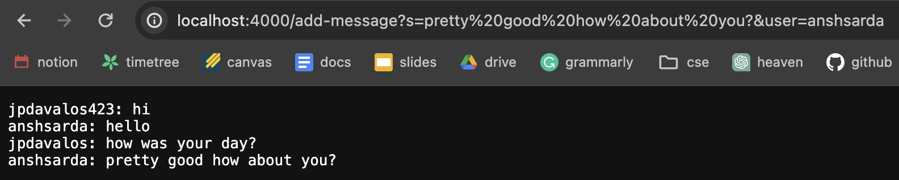
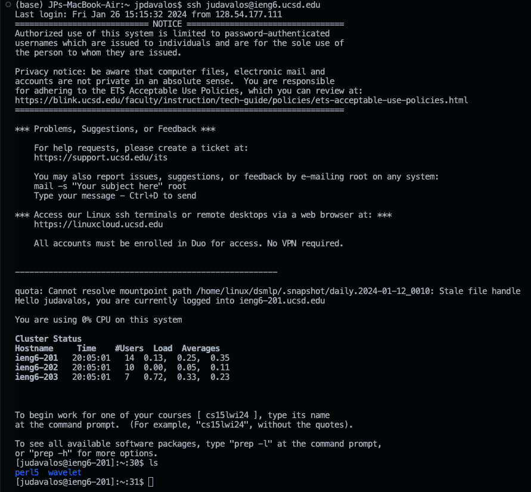

# Lab Report 2

## Part 1

### Code for `ChatServer`


### Using `ChatServer`


- The method called is `handleRequest`
- Arguments used is the value of `url`
  - `url` is http://localhost:4000/add-message?s=how%20was%20your%20day?&user=jpdavalos423
- The value of `parameters` is updated after splitting the string using `regex`
  - `parameters[0]` remains the same as `s`
  - `parameters[1]` changes to "jpdavalos"
  - `parameters[2]` remains the same as `user`
  - `parameters[3]` changes to "how was your day?"
- The value of `chat` is concatnated with the new set of strings and stored into `chat`
  -  After mnethod call the value of chat is now:
     ```
     jpdavalos: hi
     anshsarda: hello
     jpdavalos: how was your day?
     ```
     
- The value of `regex` remains the same as it is meant to facilitate the splitting of strings
- The value of `url` is changed to "http://localhost:4000/add-message?s=test&user=jpdavalos423"



- The method called is `handleRequest`
- Arguments used is the value of `url`
  - `url` is http://localhost:4000/add-message?s=pretty%20good%20how%20about%20you?&user=anshsarda
- The value of `parameters` is updated after splitting the string using `regex`
  - `parameters[0]` remains the same as `s`
  - `parameters[1]` changes to "anshsarda"
  - `parameters[2]` remains the same as `user`
  - `parameters[3]` changes to "pretty good how about you?"
- The value of `chat` is concatnated with the new set of strings and stored into `chat`
- The value of `regex` remains the same as it is meant to facilitate the splitting of strings
- The value of `url` is changed to "http://localhost:4000/add-message?s=pretty%20good%20how%20about%20you?&user=anshsarda"

## Part 2

### Absolute path of private key


### Absolute path of public key


### Logging into ieng6 account without password



## Part 3

### What I Learned

One of the biggest things I learned this week includes manipulating and analyzing strings of URLs through servers in Java. I never knew how my computer could host its own server, which is a highly convenient way of testing my code. I also learned how to log onto a remote server and what public and private keys are used for.
