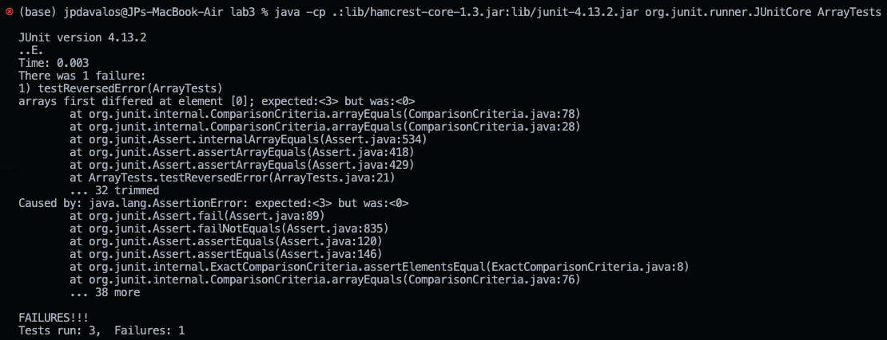

# Lab Report 3

## Part 1 - Bugs

### Failure-inducing input
```
@Test
public void testReversedError() {
  int[] input1 = { 1, 2, 3 };
  assertArrayEquals(new int[] { 3, 2, 1 }, ArrayExamples.reversed(input1));
}
```
### Not failure-inducing input
```
@Test
public void testReversed() {
  int[] input1 = {};
  assertArrayEquals(new int[] {}, ArrayExamples.reversed(input1));
}
```

### Screenshots of symptom


### Before bug fix
```
static int[] reversed(int[] arr) {
  int[] newArray = new int[arr.length];
  for(int i = 0; i < arr.length; i += 1) {
    arr[i] = newArray[arr.length - i - 1];
  }
  return arr;
}
```

### After bug fix
```
static int[] reversed(int[] arr) {
  int[] newArray = new int[arr.length];
  for (int i = 0; i < arr.length; i += 1) {
    newArray[i] = arr[arr.length - i - 1];
  }
  arr = newArray;
  return arr;
}
```

### Explanation for fix
By flipping which array the elements are reversed into and reversed from changed quite a few things. First of all, the new array has yet to be initialized with any data so by placing these values into the original array will result in an array full of zeroes. It's possible to avoid initializing the new array to be exactly the same as the original by instead adding the reversed elements into this new array. After doing this, the original array is set to the newly reversed array and this original array is returned with the reversed values.

## Part 2 - Researching Commands

### find -type

#### find -type f
This command finds all the files in the given directory. This can be useful for searching for specific file that's needed.
```
bash-3.2$ find technical/911report -type f
technical/911report/chapter-13.4.txt
technical/911report/chapter-13.5.txt
technical/911report/chapter-13.1.txt
technical/911report/chapter-13.2.txt
technical/911report/chapter-13.3.txt
technical/911report/chapter-3.txt
technical/911report/chapter-2.txt
technical/911report/chapter-1.txt
technical/911report/chapter-5.txt
technical/911report/chapter-6.txt
technical/911report/chapter-7.txt
technical/911report/chapter-9.txt
technical/911report/chapter-8.txt
technical/911report/preface.txt
technical/911report/chapter-12.txt
technical/911report/chapter-10.txt
technical/911report/chapter-11.txt
```


#### find -type d
This command finds all the directories in the given directory. This can be useful for searching and accessing a directory that may be needed.
```
bash-3.2$ find technical -type d
technical
technical/government
technical/government/About_LSC
technical/government/Env_Prot_Agen
technical/government/Alcohol_Problems
technical/government/Gen_Account_Office
technical/government/Post_Rate_Comm
technical/government/Media
technical/plos
technical/biomed
technical/911report
```

### find -mtime

#### find -mtime -7
This command finds all the files that were modified in the last 7 days. This can be useful for finding which files are being worked on recently in a project.
```
bash-3.2$ find technical -mtime -7 | head -n 10
technical
technical/government
technical/government/About_LSC
technical/government/About_LSC/LegalServCorp_v_VelazquezSyllabus.txt
technical/government/About_LSC/Progress_report.txt
technical/government/About_LSC/Strategic_report.txt
technical/government/About_LSC/Comments_on_semiannual.txt
technical/government/About_LSC/Special_report_to_congress.txt
technical/government/About_LSC/CONFIG_STANDARDS.txt
technical/government/About_LSC/commission_report.txt
```

#### find -mtime +30
This command finds all the files that were modified over 30 days ago. This can be useful for finding old files that may not be used anymore and can be deleted.
```
bash-3.2$ find technical -mtime +30

```

### find -size

#### find -size +1M
This command finds all the files larger than 1 megabyte. This can be useful for managing disk space in a project and find which files are taking up the most space. 
```
bash-3.2$ find technical -size +1M

```

#### find -size -100k
This command finds all the files smaller than 100 kilobytes. This can be useful for filtering out files of the size range.
```
bash-3.2$ find technical -size -100k | head -n 10
technical
technical/government
technical/government/About_LSC
technical/government/About_LSC/LegalServCorp_v_VelazquezSyllabus.txt
technical/government/About_LSC/Progress_report.txt
technical/government/About_LSC/Strategic_report.txt
technical/government/About_LSC/Comments_on_semiannual.txt
technical/government/About_LSC/Special_report_to_congress.txt
technical/government/About_LSC/CONFIG_STANDARDS.txt
technical/government/About_LSC/LegalServCorp_v_VelazquezDissent.txt
```

### find -iname

#### find  -iname 
This
