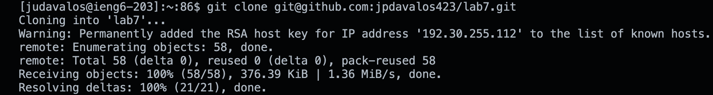

# Lab Report 4

## Step 4

Keys pressed: `<up><enter>`

The `ssh judavalos@ieng6.ucsd.edu` command is the most recent command ran on my local machine so I use the up arrow to access it.

## Step 5

Keys pressed: `<command> v <enter>`

The command `git clone git@github.com:jpdavalos423/lab7.git` is saved onto the device clipboard and is pasted using `Command + v`.

## Step 6

Keys pressed: `cd <space> lab7 <enter>, <up><up><up><up><up><up><enter>, <up><up><up><up><up><up><enter>`

I first needed to access the lab directory. `The javac -cp .:lib/hamcrest-core-1.3.jar:lib/junit-4.13.2.jar *.java` command was 6 up in the search history, so I used up arrow to access it. Then the `java -cp .:lib/hamcrest-core-1.3.jar:lib/junit-4.13.2.jar org.junit.runner.JUnitCore ListExamplesTest` command was 6 up in the history, so I accessed and ran it in the same way.

# Step 7

Keys pressed: `<control> r vi <enter>, G 6k 11l r2 :wq <Enter>`

I used `Control + r` to search for `vim` in my command history. Once in the vim editor, I used my shortcuts to quickly edit the file in order to fix it. `G` move to the end of the file. `6k` moves 6 spaces up. `11l` moves 11 spaces to the left. `r2` replaces the currently selected character with 2. `:wq` saves and quits the file.

# Step 8

Keys pressed: `<up><up><up><enter>, <up><up><up><enter>`

Same as step 6 where I accessed the command to compile the java files in the directory and proceed to run the tester file but instead the commands were 3 up in the history.

# Step 9

Keys pressed: `<control> r git <space> a <enter>, <control> r git <space> c <enter>, <control> r git <space> p <enter>`

I used `Control + r` again to search for each git command in my recently used commands. I first found the add command with `git a`, then the commit command with `git c`, then found the push command with `git p`.

